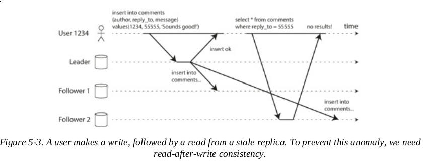
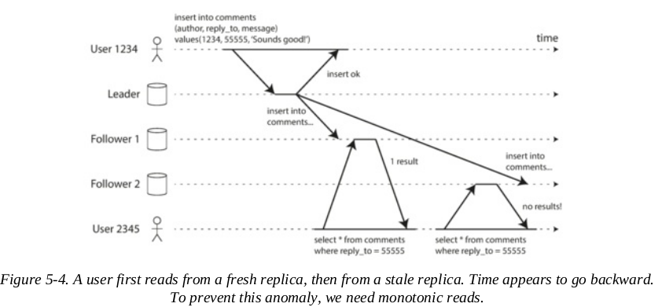
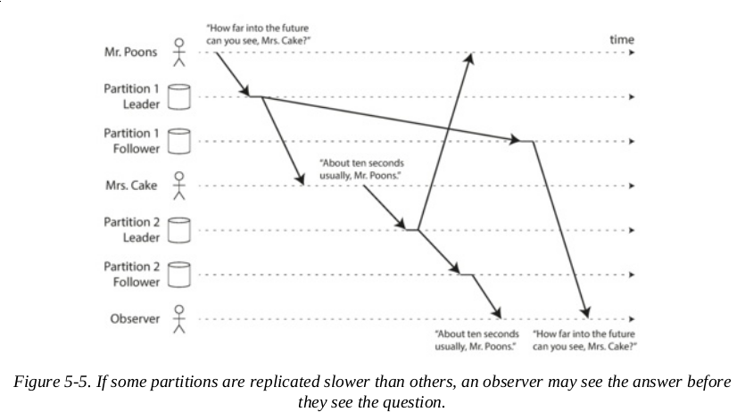

- [5. Replication](#5-replication)
  - [Part II. Distributed Data](#part-ii-distributed-data)
  - [5. Replication intro](#5-replication-intro)
    - [Leaders and Followers](#leaders-and-followers)
    - [Problems with Replication Lag](#problems-with-replication-lag)
    - [Multi-Leader Replication](#multi-leader-replication)

# 5. Replication

## Part II. Distributed Data
**Scalability**: Read or write larger than single machine, need to spread across multiple
**Fault tolerance/high availability**: App continues to work if multiple machines go down
**Latency**: Servers close to user

Shared-memory architecture and shared-disk architecture both has downsides of cost when scaling.

**Share nothing architecture** Each machine runs independently as a node
- Distributed systems has constraints and tradeoffs
- Complexity of application and limits expressiveness

#### Replication vs Paritioning
**Replication**: Keeping same data on different nodes
- Provide redundancy: if nodes are unavailable, data can still be served from other
- Can improve performance

**Partitioning**: Split DB to smaller subsets. **Sharding**

## 5. Replication intro
Why replicate?
- geographically close
- System continue working even if some parts fail
- Scale out number of machines that can serve read queries

Learnings:
- Difficulties in replication is handling changes to replicated data
- Single-leader, multi-leader and leaderless
- sync and async replication
- eventual consistency

### Leaders and Followers
How to ensure data ends up in all replicas

- **Leader based replication** aka active/assive or master-slave replication
  - 1 replica is the leader, write goes here
  - Other are followers. Leader send change to followers as part of replication log or change stream
  - Client need to read query from leader or followers. Write only on leader
  
- Relational and non relational uses this method. 
- Distributed message brokers like Kafka and RabbitMQ also uses this

#### Synch vs Async Replication
- pros of sync: guarantee of up-to-date copy o fdata
- con of sync: if follower doesn't erspond, leader will block all writes
- **semi-synchronous**: only one sync. if that sync follower is down or snow, will elect new sync follower

Leader based replication usually is async. But if fails before writes not replicated, can lose the write even if confirmed
- Advantage: leader can process writes even if followers behind
- useful if many followers and geo distribute

#### Setting up new Followers

Method without downtime:
1. Take a snapshot of leader point in time
2. Copy snapshot to new node
3. Follower connects to leader and request for changes since snapshot. Snapshot need to be associated with time
4. When follower is caught up, it process changes from leader

#### Handling node outages

**High availability**: Keep system running even single node fails

**Follower failure**: Catch-up recovery. Keep log of last transaction processed before fault. When connect again catch up on stream of data

**Leader failure**: One leader needs to be promoted to new leader. **Failover** clients reconfigured to consume from new leader.
- Determine leader failed: Node doesn't respond within time limit = dead
- Choose new leader: Election. Replica with most up-to-date 
- Reconfigure to use new leader: Client needs to send write to new leader. System needs to make sure old leader becomes a follower once it's up again

Failover issues:
- If async replication, new leader may not receive all writes from old leader before old leader failed. Most common: discard old leader's write
- Discarding write is dangerous if other storage system outside of DB needs to be coordinated. Ex. Redis and MySQL storage when MySQL db has new inconsistent leader
- **Split brain**: two nodes think they're leader and writes become conflicts
- Write timeout too short = unecessary failover. Too long = longer time to recover

#### Implementation of Replication Logs

##### Statement
**statement-based replication**: Write requests executed sent to followers

Possible ways to breakdown:
- nondeterministic function like NOW and RAND gets different valueon replicas
- Autoinc needs to be in order on each replica
- Triggers, stored procedures etc may work differently for each replica

##### Write ahead log shipping
- Append only log containin gall writes to DB
- Leader writes to log and send to followers
- Con: Logs are low level so replication is coupled with storage engine
  - If format changes, different version won't work between leader and followers
  - If replication protocol doesn't allow version mismatch = downtime
- Upgrade version by 1st upgrade followers, then failover to newly upgraded node as leader

##### Logical (row based) log replication
Different log format (**logical log**) for replication and for storage engine which allows decoupling from storage engine.

##### Trigger-based replication
Useful if only replicate subset of data, replicate one kind of DB from another, or resolution logic

**trigger** automatically run code when data change so can control where and how to replicate data

More error prone to bugs and limitations than DB built in replication

### Problems with Replication Lag
Leader-based replication good for small percent write and large read

*read scaling architecture*: increase capacity of read by adding more followers
- Works good with async
- Sync will be unreliable as single node down make system unavailable for writing

**eventual consistency**: Read on leader and follower is different since writes haven't been reflected in follower
- Delay could be fraction of second or minutes if max capacity or issue with network

#### Reading your own writes

**read-after-write consistency**: User will see updated submitted immediately
- Read user profile from the leader. Need way to know if user is looking at user's own profiel
- Track time of last update and recent changes pull from leader
- Client remember recent write, systems can make sure updates reflect until that timestamp
- Distrubted across geo is harder
- Cross devices
  - Client timestamp doesn't work bc one device doesnt know other device last update timestamp = metadata centralized
  - Across datacenter = need to locate devices to same datacenter

#### Monotonic Reads
**moving backward in time**: anomaly with async followers

- **Monotonic reads**: no back in time reads
- User read from single replica based on hash
- If fail then need to route to different replica

#### Consistent Prefix Reads
- Inconsistent order in data read 

- **Consistent Prefix Reads**: write happens in order, anyone reading will see them appear in order
  - Occurs when DB are partitioned or sharded. IE User A in one shard, user B in another
  - Solution is to make writes that are causually related written in same partition but cannot be efficient

#### Solutions for Replication Lag
Solutions explored above can make application code complesx

Eventuall consistency is inevitable in scalable system

### Multi-Leader Replication
- More than one node accept writes
- **multi-leader configuration**: leader acts as follower and leaders

#### Use cases for MLR

##### Multi-datacenter operation
- leader in each datacenter and they both replicate each other's changes
- Performance: writes to local leader is faster so perceived performance is better
- Outage tolerance: data center operate independently
- network tolerance: async replication tolerate network problems better

**Conflict resolution**: Same data concurently modified in different datacenters and conflicts need to be resolved

Retrofitted features in many DB can lead to quirks

##### Clients with offline operation
Moblie devices with offline capability needs to be sync is in effect like 'leaders' with multi-leader replication process taken to the extreme